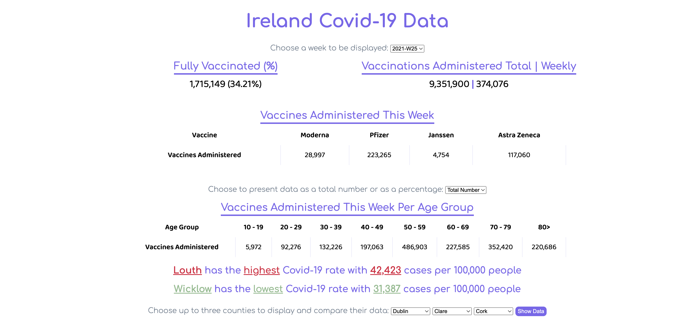
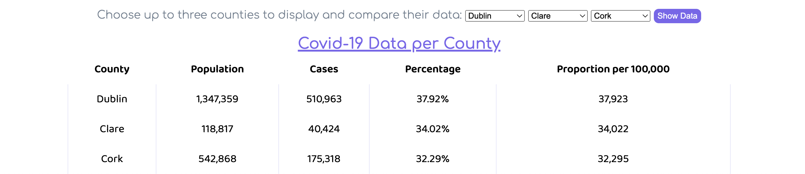

# Ireland Covid-19 Data Showcase

This project showcases Ireland's Covid-19 statistics, including vaccination data, county statistics, and more.

## Features

- Choose a week to display Covid-19 data.
- View the percentage of fully vaccinated individuals.
- Explore different vaccines administered in the current week.
- Compare Covid-19 data for up to three counties.

## Usage

1. Open the website.
2. Choose a week from the dropdown menu.
3. Explore the Covid-19 data and vaccination statistics.
4. Select counties to compare their Covid-19 data.

## Screenshots

